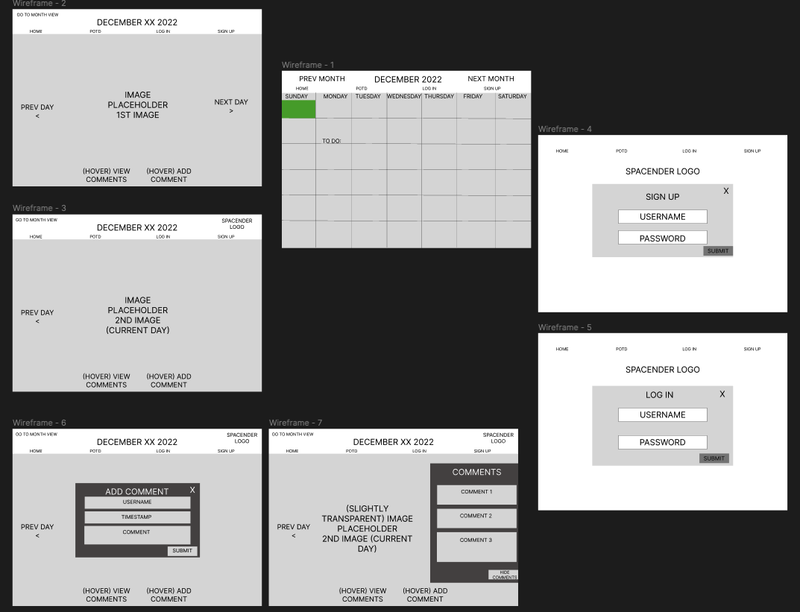

# Spacendar 👾🔭🪐
is a calendar for space lovers and enthusiasts. Wake up to a new photo of the universe, everyday. Users are able to view the current day's photo or look back in time to previous days, months or even years. Log in to comment on your favorite photos, share with friends, and get lost in space.

## Spacendar
[GitHub Repo](https://github.com/case02/spacendar
)
## Wireframes: 
[Prototype](https://www.figma.com/proto/eVNUQhWYYLBGpXavMGYfq6/SPACENDAR?node-id=1%3A44&scaling=min-zoom&page-id=0%3A1&starting-point-node-id=1%3A2)
# 

## Team Roles
Markup : 

           
Casey Stocker

           
GitHub Manager

         

## User Stories:
- As an aspiring astronaut, Spacendar allows me to discover a new image of the universe every day and comment and share with my friends.
- As a parent to a child who is interested in space, we are able to start each morning with a lesson about what the daily image shows and do our own research on where it came from.
- As an astronomy professor, I use Spacendar to start my daily lessons and allow students to comment in their own words an explanation of the photos.

### Route Page
[Route Page Project 3.xlsx](https://github.com/case02/spacendar/files/10263256/Route.Page.Project.3.xlsx)

